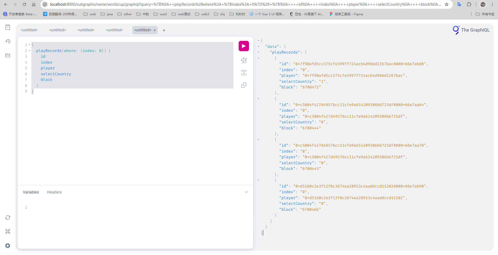

# 工程创建文档
https://doc.pursue.pub/02.%E5%8C%BA%E5%9D%97%E9%93%BE/24.The%20Graph%E7%9A%84GraphNode%E5%92%8CSubgraph%E6%9C%AC%E5%9C%B0%E6%90%AD%E5%BB%BA.html

# 启动graphnode
docker-compose up

# 创建并
npm run codegen
npm run build
npm run create-local
npm run deploy-local

# Deployed to http://localhost:8000/subgraphs/name/duke/worldcup/graphql

PS：npm run create-local步骤会伴随connectedrefused，可能是因为docker-compose.yml中version字段的原因，休要反复进行create-local和deploy-local操作

graphql查询：
{
  playRecords(where: {index: 0}) {
    id
    index
    player
    selectCountry
    block
  }
}

{
  finializeHistories {
    id
    result
  }
}

